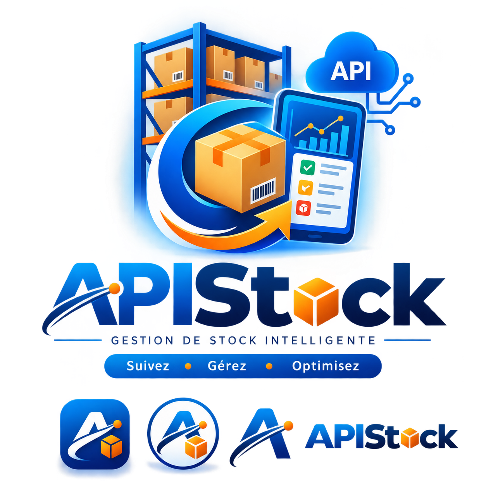

  

Plateforme professionnelle de gestion de stock — API REST, Frontend Next.js, Desktop Electron, CI/CD GitLab, Tests automatisés, Architecture modulaire et innovations IA.

# APISTOCK — Plateforme Professionnelle de Gestion de Stock

APISTOCK est une solution complète et moderne de **gestion de stock**, conçue pour les entreprises, entrepôts, commerces et systèmes logistiques qui nécessitent une API fiable, sécurisée et performante pour gérer leurs opérations.

Le projet met l’accent sur la **qualité du code**, la **sécurité**, la **scalabilité**, et une **pipeline CI/CD de niveau industriel**.

---

## Objectif du Projet

APISTOCK vise à :

- Centraliser et automatiser la gestion des stocks  
- Offrir une API REST robuste et sécurisée  
- Permettre l’intégration avec des applications web, desktop et mobiles  
- Garantir une qualité logicielle élevée grâce à des tests complets  
- Fournir une architecture DevOps professionnelle (CI/CD, analyse qualité, tests automatisés)

---

## Architecture du Projet

Le projet est organisé en plusieurs modules indépendants mais complémentaires :

### **1. Backend (Node.js + Express + MongoDB)**
- API REST complète  
- Gestion des produits, catégories, lots, mouvements  
- Validation stricte des données  
- Sécurité (headers, rate limiting, sanitisation)  
- Tests unitaires et d’intégration

### **2. Frontend (Next.js / React)**
- Interface utilisateur moderne  
- Tableau de bord de gestion de stock  
- Visualisation des données et reporting

### **3. Application Desktop (Electron)**
- Version hors-ligne  
- Synchronisation automatique  
- Interface dédiée aux entrepôts

### **4. DevOps**
- GitLab CI/CD  
- SonarQube (qualité du code)  
- Husky (pré-commit / pré-push)  
- ESLint + Prettier  
- Playwright (tests E2E)  
- Artillery (tests de charge)

### **5. Dossier de Tests**
- Tests unitaires (Jest)  
- Tests d’intégration (Supertest)  
- Tests E2E (Playwright)  
- Tests de charge (Artillery)

---

## Documentation Fonctionnelle / API

Cette section présente les fonctionnalités principales du projet ainsi que la structure générale de son API.

---

### Endpoints principaux

| Méthode | Endpoint | Description |
|--------|----------|-------------|
| GET    | /resource | Récupération des données principales |
| POST   | /resource | Création d’une nouvelle ressource |
| PUT    | /resource/:id | Mise à jour d’une ressource existante |
| DELETE | /resource/:id | Suppression d’une ressource |

> Remplacer **resource** par le nom réel selon le projet  
> (ex : `/animals`, `/stocks`, `/alerts`, `/users`, etc.)

---

### Paramètres importants

- **id** : Identifiant unique de la ressource  
- **token** : Jeton d’authentification (JWT)  
- **animalId / stockId / userId** : Identifiants spécifiques selon le projet  
- **limit / page** : Paramètres de pagination  
- **filter** : Filtrage des données  

---

### Réponses de l’API

- **200 – Succès**  
  La requête a été traitée correctement.

- **201 – Créé**  
  Une nouvelle ressource a été ajoutée.

- **400 – Erreur de validation**  
  Paramètres manquants ou invalides.

- **401 – Non authentifié**  
  Jeton invalide ou absent.

- **403 – Non autorisé**  
  L’utilisateur n’a pas les permissions nécessaires.

- **404 – Introuvable**  
  Ressource inexistante.

- **500 – Erreur serveur**  
  Problème interne du système.

---

### Sécurité

- **JWT** pour l’authentification  
- **RBAC** (Role-Based Access Control) pour la gestion des permissions  
- **Chiffrement** des données sensibles  
- **Audit logs** pour tracer les actions importantes  
- **Validation stricte** des entrées utilisateur  

---

### Modules / Fonctionnalités principales

- Fonctionnalité 1 : [Décrire la fonction principale du projet]  
- Fonctionnalité 2 : [Décrire une fonction secondaire]  
- Fonctionnalité 3 : [Décrire une interaction avec un autre service]  

> Remplacer ces lignes par les vraies fonctionnalités selon le repo.

---

### Intégration dans l’écosystème API Business Technology

Ce projet fait partie de l’écosystème global et interagit avec :

- [Nom du produit principal]  
- [Backend / Frontend / DevOps / IA / IoT]  
- [Autres services liés]  

---

## Qualité & Tests

APISTOCK applique une stratégie de qualité logicielle inspirée des standards des grandes entreprises :

### Tests unitaires (Jest)
Validation des fonctions, services et contrôleurs.

### Tests d’intégration (Supertest)
Validation des endpoints API avec la base de données.

### Tests E2E (Playwright)
Simulation des parcours utilisateurs réels.

### Tests de charge (Artillery)
Simulation de trafic intensif pour mesurer la performance.

### Linting (ESLint)
Règles strictes pour garantir un code propre et cohérent.

### Formatage (Prettier)
Style uniforme sur tout le projet.

### Hooks Husky
- `pre-commit` → lint + format  
- `pre-push` → tests + sécurité

### Analyse qualité (SonarQube)
Détection des duplications, bugs, vulnérabilités.

---

## CI/CD — Pipeline Professionnelle (GitLab)

La pipeline CI/CD d’APISTOCK est conçue pour assurer :

- Fiabilité  
- Qualité  
- Sécurité  
- Performance  
- Déploiement automatisé

### **Jobs CI/CD :**

| Job | Description |
|-----|-------------|
| `lint` | Analyse ESLint + Prettier |
| `test:unit` | Tests unitaires Jest |
| `test:integration` | Tests d’intégration Supertest |
| `test:e2e` | Tests Playwright |
| `test:load` | Tests de charge Artillery |
| `sonar` | Analyse qualité SonarQube |
| `build` | Préparation des artefacts |
| `deploy` | Déploiement automatisé |

### **Badges GitLab (à ajouter)**

## Technologies Utilisées

- Node.js 22  
- Express.js  
- MongoDB / Mongoose  
- Jest  
- Supertest  
- Playwright  
- Artillery  
- ESLint  
- Prettier  
- Husky  
- GitLab CI/CD  
- SonarQube  
- Next.js  
- Electron  

---

## Structure du Projet

dossier_projet_gestionstock/
│
├── backend_APISTOCK/
├── frontend_apistock/
├── desktop_APISTOCK/
├── devops/
├── dossier_test/
│   ├── unit/
│   ├── integration/
│   ├── e2e/
│   └── load/
├── sonarqube/
├── .gitlab-ci.yml
├── .prettierrc
└── README.md

---

## Diagramme d’Architecture (version texte)

[Frontend] → [API Backend] → [MongoDB]
↓             ↓
[Desktop App]   [Pipeline CI/CD]

---

## Roadmap

- Module d’alertes pour stock critique  
- Génération de rapports PDF  
- Authentification avancée (RBAC)  
- Monitoring Prometheus + Grafana  
- Microservice “Stock Sync”  
- Optimisation performance API  

---

## Auteur

**Pierre Richard Saint Louis**  
Diplômé en **Programmation informatique (DEC)** — Collège La Cité  
Titulaire d’un **Baccalauréat en Finance**  
Fondateur de **API Business Technology**

Professionnel passionné par l’ingénierie logicielle, le DevOps, la qualité logicielle, la sécurité applicative et l’architecture de systèmes.  
Pierre combine une expertise technique solide avec une vision analytique issue de la finance, lui permettant de concevoir des solutions robustes, performantes et adaptées aux besoins opérationnels des entreprises.

